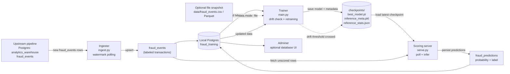
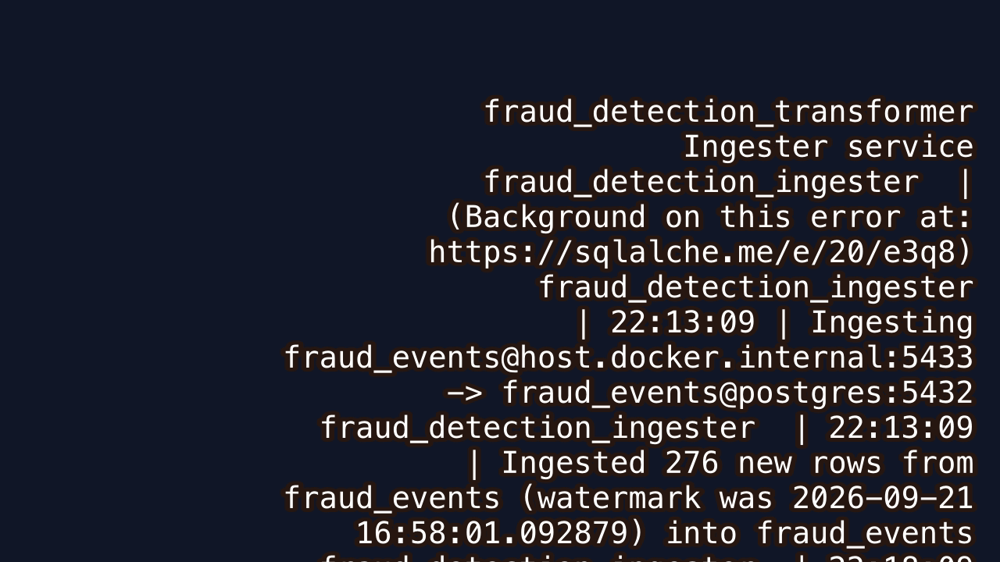
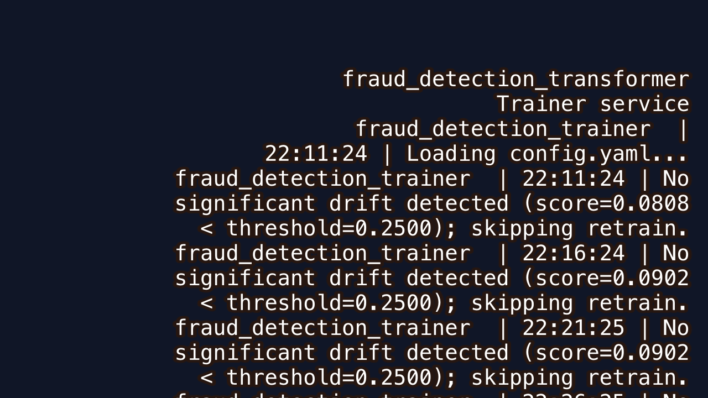
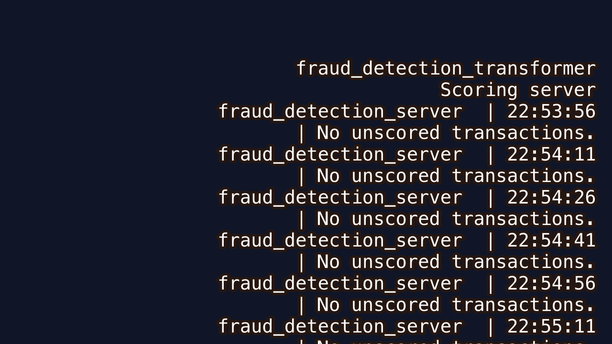
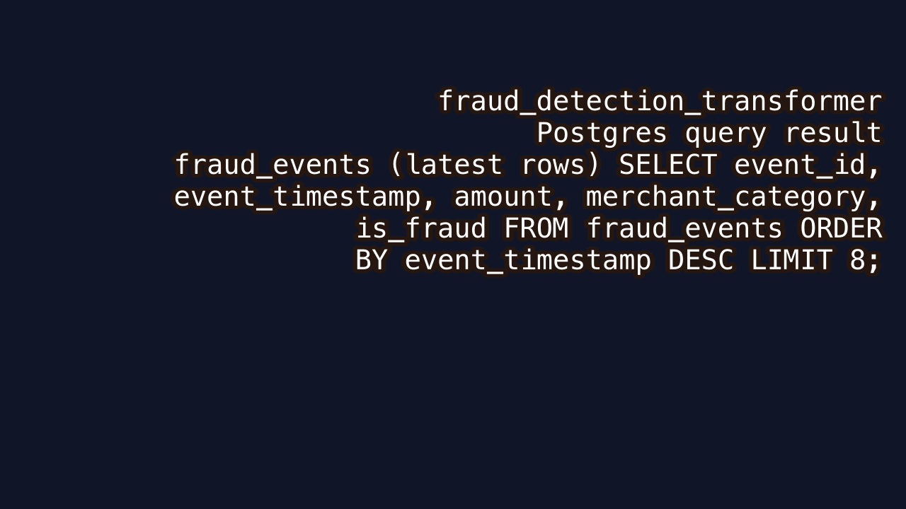
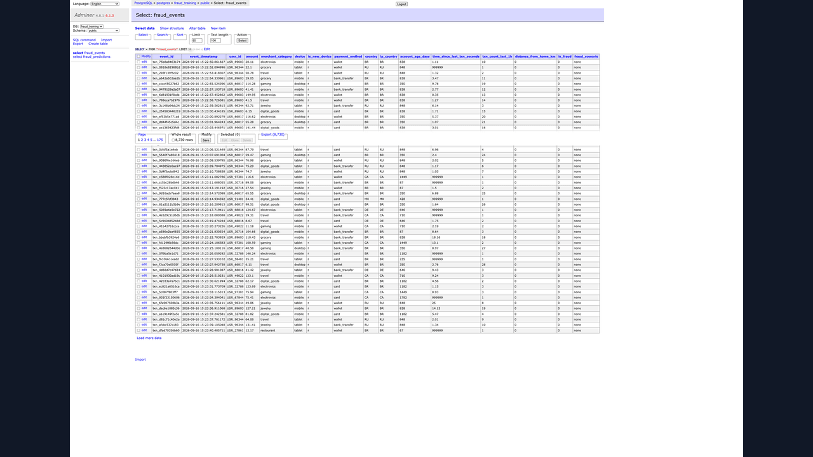

# Fraud Detection Transformer

## Service flow



In Docker Compose, `postgres`, `ingester`, `trainer`, `server`, and `adminer` run
as separate services. In Render, the trainer and scoring server share one worker
so they can use the same persistent `checkpoints/` disk.

## Live service output

These GIFs were captured from the running Docker Compose stack. The Postgres GIF
shows recent rows from both tables, and the Adminer GIF cycles through the live
schema, `fraud_events`, and `fraud_predictions` views. Refresh the text and
database captures with `scripts/capture_service_output_gifs.sh`.

| Service | Output |
|---------|--------|
| Ingester |  |
| Trainer |  |
| Scoring server |  |
| Postgres |  |
| Adminer |  |

## Running the full pipeline

```bash
cd local-gcp-mirror-pipeline && docker compose up -d
python kafka/mock_producer.py            # generates labeled transactions
python spark/jobs/streaming_ingest.py     # streams into Postgres fraud_events
# not needed anymore --> python scripts/export_training_data.py --output-dir ../fraud_detection_transformer/data

cd ../fraud_detection_transformer
pip install -r requirements.txt
python baseline.py    # train/evaluate the gradient-boosting baseline
```

Training and live scoring (`main.py`, `serve.py`) now run as Docker services (see
below) instead of directly on the host, since they depend on this repo's own
Postgres db.

## Ingesting into this repo's own Postgres db (for train/test splitting)

Requires local-gcp-mirror-pipeline's postgres to be up (port 5433) since that's
the source.

```bash
docker compose up -d --build      # starts Postgres + adminer + ingester + trainer + server
```

- **ingester** polls local-gcp-mirror-pipeline's `fraud_events` table
  (`config.yaml -> ingest.source`) every `ingest.poll_interval_seconds`, pulling
  only rows newer than what's already ingested, and upserts them into this
  repo's `fraud_training` db (`config.yaml -> ingest.db`).
- **trainer** runs `main.py`: retrains the transformer whenever the live data
  has drifted past `config.yaml -> drift.threshold` (checked every
  `drift.check_interval_seconds`), and writes `checkpoints/best_model.pt` +
  `inference_meta.pkl`.
- **server** runs `serve.py`: continuously scores new, unscored transactions
  from `fraud_training` using the latest checkpoint and persists each
  prediction (`fraud_probability` / `predicted_is_fraud`) to the
  `fraud_predictions` table (`config.yaml -> serving`), so results survive
  restarts and are queryable directly.

To run either as a one-off instead of inside Docker (e.g. for local debugging):

```bash
python main.py --once
python serve.py --once
```

Then point training/serving at the db instead of the file snapshot:

```yaml
# config.yaml
data:
  mode: db
```

To browse `fraud_training` / `fraud_predictions` in a web UI, open
[http://localhost:8082](http://localhost:8082) (Adminer) and log in with:

| Field    | Value            |
|----------|------------------|
| System   | PostgreSQL       |
| Server   | postgres         |
| Username | fraud            |
| Password | fraud_password   |
| Database | fraud_training   |
